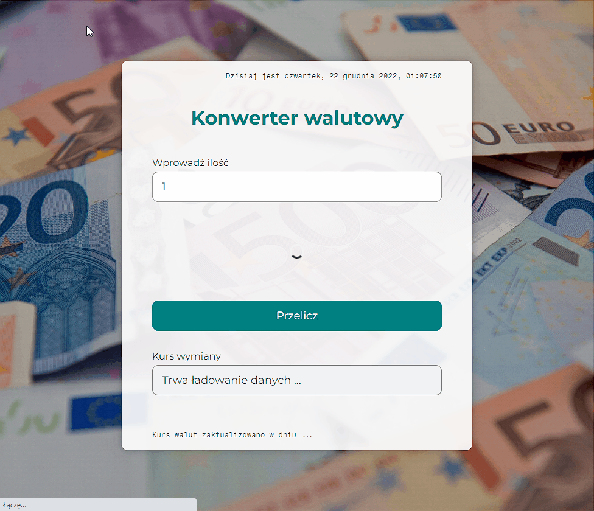

## DEMO

https://lkkolosowski.github.io/currency-converter-react/

## Preview

## Description

This application is a currency calculator that can calculate how much of a particular monetary unit is needed in a given country to obtain its equivalent value. The data is updated in real-time from the European Central Bank. Enjoy 😊

## Technologies

### HTML/CSS
- Semantic HTML
- normalize.css
- Flex
- Grid

### basic JS
- Arrays/Objects
- Immutability
- Math.random
- Date method

### React
- Create React App
- React Hooks: useState, useEffect
- Babel
- WebPack

### advanced JS
- Axios
- Async, await
- Fetching data from open API
- styled-components

# Getting Started with Create React App

This project was bootstrapped with [Create React App](https://github.com/facebook/create-react-app).

## Available Scripts

In the project directory, you can run:

### `npm start`

Runs the app in the development mode.\
Open [http://localhost:3000](http://localhost:3000) to view it in your browser.

The page will reload when you make changes.\
You may also see any lint errors in the console.

### `npm run build`

Builds the app for production to the `build` folder.\
It correctly bundles React in production mode and optimizes the build for the best performance.

The build is minified and the filenames include the hashes.\
Your app is ready to be deployed!

See the section about [deployment](https://facebook.github.io/create-react-app/docs/deployment) for more information.
